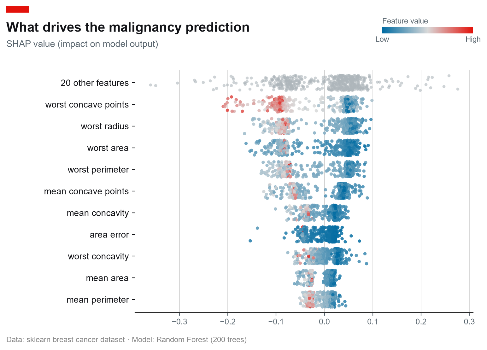

<h1 align="center">shap-editorial</h1>

<p align="center">
  <strong>Publication-ready charts for SHAP explanations.</strong><br>
  Your SHAP values, in a chart good enough to publish — one function call, no manual rework.
</p>

<p align="center">
  <a href="https://github.com/nishantnayar/shap-editorial/actions/workflows/ci.yml">
    
  </a>
  
  
  
</p>

---

<p align="center">
  
</p>

<p align="center"><em>One <code>beeswarm()</code> call — <em>The Economist</em>-style red tab, title block, house palette, and a horizontal colour key, ready to publish.</em></p>

## What it is

`shap-editorial` is a thin **styling and layout layer** on top of
[`shap`](https://github.com/shap/shap)'s `Explanation` objects. It takes the
SHAP values you already computed and renders them as charts you can drop
straight into a blog post, paper, deck, or portfolio project.

It is **not** a new interpretability method, **not** a SHAP computation
library, and **not** a production-monitoring or compliance tool. It does one
small, unglamorous thing well: *make the chart look good.*

### Why it exists

SHAP's built-in plots (`summary_plot`, `beeswarm`, `waterfall`) are
mathematically correct but visually "default matplotlib, by a researcher, for a
researcher" — cramped labels, jargon axis titles (`E[f(x)]`, `phi`), and
inconsistent styling across plot types. Getting them publication-ready means
manual rework in another tool. This package removes that step.

|                        | `shap.summary_plot()`         | `shap_editorial.beeswarm()`               |
| ---------------------- | ----------------------------- | ----------------------------------------- |
| Typography             | matplotlib defaults           | Economist-style font stack, sized hierarchy |
| Title / subtitle       | none / jargon axis label      | Red corner tab, bold flush-left title, plain-language subtitle |
| Colour palette         | SHAP red/blue                 | *The Economist*'s house blue → red          |
| Colour key             | vertical bar, rotated label   | Horizontal key, horizontal labels           |
| Source / attribution   | none                          | Optional source line                      |
| Cross-chart consistency| varies by plot type           | Shared theme + finalize layer             |

## Install

Not yet on PyPI — install from source. Using [uv](https://docs.astral.sh/uv/)
(recommended):

```bash
git clone https://github.com/nishantnayar/shap-editorial.git
cd shap-editorial
uv sync --extra dev
```

Or with pip:

```bash
pip install -e ".[dev]"          # core + test tooling
pip install -e ".[example]"      # adds shap + scikit-learn for the demo script
```

**Runtime dependencies are only `matplotlib` and `numpy`.** `shap` itself is
*not* required to use this package — input is duck-typed (see below).

## Quickstart

```python
import shap
import shap_editorial as se

# 1. Compute SHAP values however you normally would
explainer = shap.TreeExplainer(model)
explanation = explainer(X_test)          # a shap.Explanation object

# 2. Render it, publication-ready
fig, ax = se.beeswarm(
    explanation,
    title="What drives the churn prediction",
    subtitle="SHAP value (impact on model output)",
    source="Source: internal model v3 · n = 2,000 held-out customers",
    max_display=10,
)

# 3. Save at whatever DPI you need
fig.savefig("beeswarm.png", dpi=200, bbox_inches="tight")
```

`beeswarm()` returns the `(fig, ax)` pair, so you keep full matplotlib control
for any further tweaks.

### Run the real end-to-end example

```bash
uv run --extra example python examples/example_beeswarm.py
```

Trains a `RandomForestClassifier` on scikit-learn's breast-cancer dataset,
computes real SHAP values, and writes `examples/beeswarm_output.png`.

## API

| Object                | Description                                                                 |
| --------------------- | --------------------------------------------------------------------------- |
| `beeswarm(...)`       | Global feature-impact summary. Returns `(fig, ax)`.                         |
| `set_theme()`         | Apply the editorial matplotlib `rcParams` globally (called automatically by chart functions). |
| `ShapEditorialError`  | Raised when the input isn't a usable SHAP explanation. Subclass of `ValueError`. |

### `beeswarm` signature

```python
beeswarm(
    shap_values,
    *,
    max_display: int = 10,
    title: str | None = None,
    subtitle: str | None = "SHAP value (impact on model output)",
    source: str | None = None,
    feature_names=None,
    figsize=(8, 5.5),
    ax=None,
)
```

- **`shap_values`** — a `shap.Explanation` (or any object exposing `.values`,
  `.data`, and optionally `.feature_names`). Must be single-output
  (binary classification or regression).
- **`max_display`** — features shown individually before the rest collapse into
  a single "N other features" row (summed per sample, preserving the additive
  property).
- **`title` / `subtitle` / `source`** — the editorial text stack. Pass `None`
  to omit any of them.
- **`feature_names`** — override names on the explanation object.
- **`ax`** — draw onto an existing axes instead of creating a new figure.

## Design principles

- **Duck-typed input, no hard `shap` dependency.** Anything shaped like a
  `shap.Explanation` works. This keeps the install light and makes testing fast.
- **Multiclass is rejected, not guessed.** A 3-D `values` array raises
  `ShapEditorialError` telling you to slice a class first
  (`shap_values[..., class_index]`). Silently picking a class misleads more
  than it helps.
- **Self-contained theme.** Palette and font stack live in one module; no
  dependency on any external charting-style package.
- **Public API is the chart functions.** Everything else is a private module
  (leading underscore) and not guaranteed stable.

## Development

```bash
uv sync --extra dev
uv run python -m pytest tests/ -q
```

Tests use a lightweight `FakeExplanation` stand-in rather than importing the
real `shap` package, so the suite stays fast and dependency-light. Plotting
tests run headless via matplotlib's `Agg` backend.

## Roadmap

- [x] `beeswarm()` — global feature-impact summary
- [x] Packaging, CI, LICENSE
- [ ] `waterfall()` — single-prediction explanation
- [ ] `bar()` — global feature-importance bar chart
- [ ] First PyPI release (`v0.1`)

**Out of scope** (by design): real-time model monitoring, drift/bias
detection, new SHAP computation methods, and regulatory/compliance outputs.

## Contributing

New chart types should follow the `beeswarm` pattern: take a
`shap.Explanation`-shaped object, extract arrays via `_utils.py`, render with
the shared theme, and finish with `_finalize.finalize()` so every chart looks
consistent with the others.

## License

[MIT](LICENSE) © 2026 Nishant Nayar
