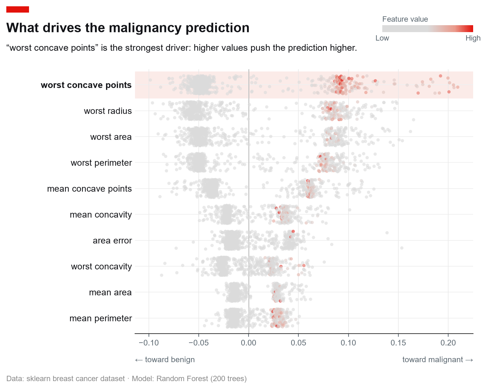
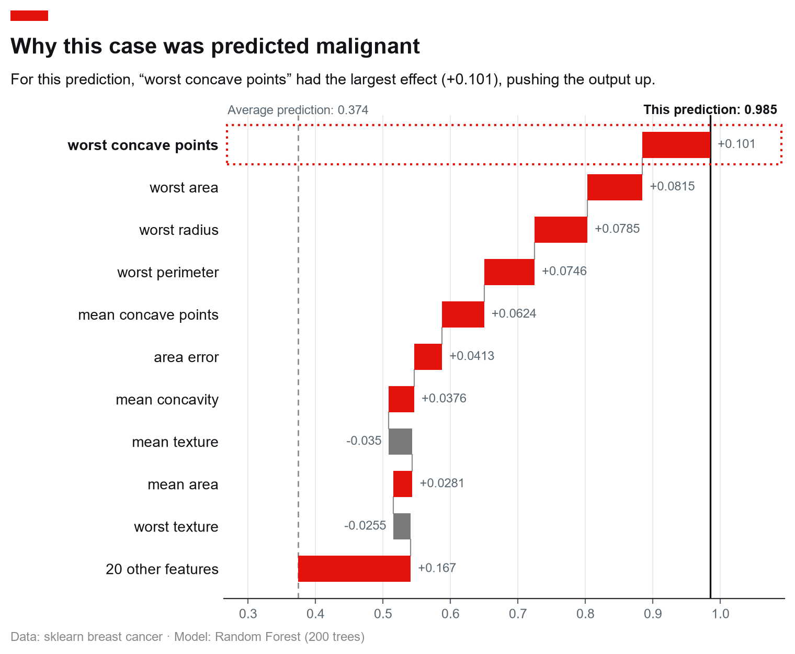
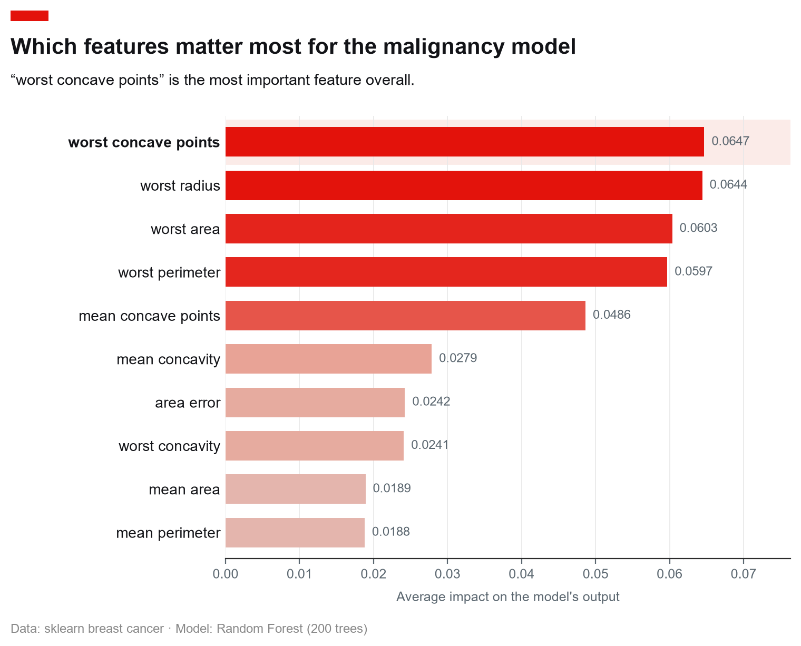
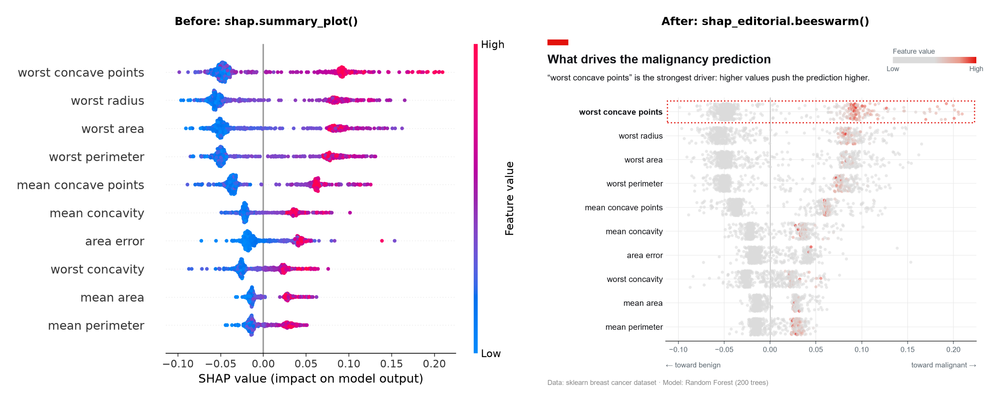

<h1 align="center">shap-editorial</h1>

<p align="center">
  <strong>Turn model explanations into charts you can actually publish.</strong><br>
  One line of code turns SHAP's output into a clean, self-explaining chart for a report, a slide, or a paper. No design work, no manual rework.
</p>

<p align="center">
  <a href="https://github.com/nishantnayar/shap-editorial/actions/workflows/ci.yml">
    
  </a>
  
  
  
</p>

---

<p align="center">
  
</p>

<p align="center"><em>One <code>beeswarm()</code> call - <em>The Economist</em>-style title block, an auto-generated takeaway line, a highlighted top driver, directional axis cues, and an explainable grey→red colour scale, ready to publish.</em></p>

<p align="center">
  
</p>

<p align="center"><em>…and one <code>waterfall()</code> call to explain a single prediction - same red tab and grey→red palette, plain-language endpoints (<em>Average prediction → This prediction</em>, no <code>E[f(x)]</code>/<code>f(x)</code> jargon), and an auto takeaway.</em></p>

<p align="center">
  
</p>

<p align="center"><em>…and one <code>bar()</code> call for a clean importance ranking. Every chart type shares the same look.</em></p>

## What it is

Machine-learning models predict well but explain poorly: they tell you *what*
they decided, not *why*. [SHAP](https://github.com/shap/shap) is the widely used
tool that closes that gap, measuring how much each input feature pushed a
prediction. `shap-editorial` takes that analysis and turns it into a clean,
self-explaining chart in **one line of code**.

Out of the box, SHAP's own charts look like raw research output: cramped labels,
mathematical axis titles, and no headline. This package restyles them for a
human audience, so the result is ready for a report, a slide deck, a blog post,
or a paper without a trip through a design tool.

- **Already use SHAP?** It is a drop-in styling layer: your existing values go
  in, a polished chart comes out. It does not compute SHAP values or add new
  interpretability methods; it only makes the output look good.
- **New to SHAP?** The charts are built to be read at a glance: a plain-language
  title, a one-sentence takeaway, and clear cues for which way each feature
  pushes the prediction, instead of jargon.

### What each chart answers

| Chart | The question it answers |
|---|---|
| **beeswarm** | Across all your data, which features matter most, and which way do they push the prediction? |
| **waterfall** | For one specific case, why did the model land on this prediction? |
| **bar** | A simple ranking: which features matter most overall? |
| **scatter** | For one feature, how does its value relate to its effect on the prediction? |

### See the difference

The same SHAP output, drawn by SHAP's default plot (left) and by
`shap-editorial` (right):

<p align="center">
  
</p>

<details>
<summary><strong>Feature-by-feature comparison with SHAP's built-in plots</strong></summary>

|                        | `shap.summary_plot()`         | `shap_editorial.beeswarm()`               |
| ---------------------- | ----------------------------- | ----------------------------------------- |
| Typography             | matplotlib defaults           | Economist-style font stack, sized hierarchy |
| Title / subtitle       | none / jargon axis label      | Red corner tab, bold flush-left title, plain-language subtitle |
| Analysis               | none                          | Auto takeaway line + highlighted top-driver row |
| Direction cues         | reader must infer             | "← pushes prediction lower / higher →" under the axis |
| Colour scale           | SHAP red/blue                 | Explainable grey → red ("redder = higher"), high values pop |
| Colour key             | vertical bar, rotated label   | Horizontal key, horizontal labels           |
| Source / attribution   | none                          | Optional source line                      |
| Cross-chart consistency| varies by plot type           | Shared theme + finalize layer             |

</details>

## Install

Not yet on PyPI - install from source. Using [uv](https://docs.astral.sh/uv/)
(recommended):

```bash
git clone https://github.com/nishantnayar/shap-editorial.git
cd shap-editorial
uv sync --extra dev
```

Or with pip:

```bash
pip install -e ".[dev]"          # core + test tooling
pip install -e ".[example]"      # adds shap + scikit-learn for the demo script
```

**Runtime dependencies are only `matplotlib` and `numpy`.** `shap` itself is
*not* required to use this package - input is duck-typed (see below).

## Quickstart

```python
import shap
import shap_editorial as se

# 1. Compute SHAP values however you normally would
explainer = shap.TreeExplainer(model)
explanation = explainer(X_test)  # a shap.Explanation object

# 2. Render it, publication-ready - an auto takeaway line, a highlighted
#    top driver, and directional axis labels come for free.
fig, ax = se.beeswarm(
    explanation,
    title="What drives the churn prediction",
    source="Source: internal model v3 · n = 2,000 held-out customers",
    max_display=10,
)

# 3. Save at whatever DPI you need
fig.savefig("beeswarm.png", dpi=200, bbox_inches="tight")
```

`beeswarm()` returns the `(fig, ax)` pair, so you keep full matplotlib control
for any further tweaks.

> **Tips**
> - **Any format.** Because you get the `fig` back, save wherever matplotlib
>   can: `fig.savefig("chart.png" | ".jpg" | ".svg" | ".pdf", dpi=200,
>   bbox_inches="tight")`. Use **SVG/PDF** for crisp, resolution-independent
>   figures in print/decks; raster (`.png`/`.jpg`) for the web.
> - **Transparent backgrounds** (`beeswarm`, `waterfall`, and `bar`): pass
>   `transparent=True` for slides or dark pages. Save to a format with an alpha
>   channel - **PNG, SVG, or PDF** - since **JPEG has no transparency** and will
>   flatten the background to a solid colour.

### Run the real end-to-end examples

```bash
uv run --extra example python examples/beeswarm_quickstart.py   # the hero chart
uv run --extra example python examples/beeswarm_gallery.py       # many datasets/tasks
uv run --extra example python examples/waterfall_quickstart.py   # single-prediction waterfall
uv run --extra example python examples/bar_quickstart.py         # global importance bar chart
uv run --extra example python examples/scatter_quickstart.py     # one feature's effect in depth
uv run --extra example python examples/beeswarm_comparison.py    # side-by-side before/after vs stock SHAP
```

`beeswarm_quickstart.py` trains a `RandomForestClassifier` on scikit-learn's
breast-cancer dataset and writes `examples/images/beeswarm/hero.png`.
`beeswarm_gallery.py` renders a range of datasets and tasks - see
[`examples/`](examples/) for the full gallery and how to run it.
`beeswarm_comparison.py` generates a side-by-side before/after image comparing
stock SHAP output with `shap-editorial`'s beeswarm.

## API

| Object                | Description                                                                 |
| --------------------- | --------------------------------------------------------------------------- |
| `beeswarm(...)`       | Global feature-impact summary across all samples. Returns `(fig, ax)`.      |
| `waterfall(...)`      | Single-prediction explanation - how each feature moves the output from the average prediction to this one. Returns `(fig, ax)`. |
| `bar(...)`            | Global feature-importance ranking (mean \|SHAP\| per feature). Returns `(fig, ax)`. |
| `scatter(...)`        | Dependence plot for one feature: its value vs its SHAP value, optionally coloured by a second feature. Returns `(fig, ax)`. |
| `set_theme(transparent=False)` | Apply the Economist-style matplotlib `rcParams` globally. Chart functions apply the theme internally via `rc_context()` without touching your global settings; call `set_theme()` only if you want the style to persist across your own plots. Pass `transparent=True` for a no-background theme. |
| `ShapEditorialError`  | Raised when the input isn't a usable SHAP explanation. Subclass of `ValueError`. |

### `beeswarm` signature

```python
beeswarm(
    shap_values,
    *,
    max_display: int = 10,
    title: str | None = None,
    subtitle: str | None = None,
    source: str | None = None,
    feature_names=None,
    figsize=None,
    show_other: bool = False,
    analysis: bool | str = True,
    highlight: bool = True,
    direction_labels: bool | tuple[str, str] = True,
    transparent: bool = False,
    ax=None,
)
```

- **`shap_values`** - a `shap.Explanation` (or any object exposing `.values`,
  `.data`, and optionally `.feature_names`). Must be single-output
  (binary classification or regression).
- **`max_display`** - number of top features (by mean |SHAP|) to show.
- **`show_other`** - when `True`, collapse the remaining features into a single
  "N other features" row at the bottom (per-sample sum, preserving the additive
  property). Defaults to `False` - just the top `max_display`. That aggregate
  row can't carry the colour scale (it sums across features), so it renders flat
  grey; it's opt-in for completeness.
- **`analysis`** - the editorial takeaway line under the title. `True` (default)
  auto-generates a one-sentence insight from the top driver's SHAP pattern
  (e.g. *"'worst concave points' is the strongest driver: higher values push the
  prediction lower"*); pass a string for your own, or `False` to omit. The
  auto text only narrates the pattern already in the plot - no new computation.
- **`highlight`** - when `True` (default), draw a subtle band behind the
  top-driver row and bold its label so the eye lands on the strongest feature.
- **`direction_labels`** - small labels under the x-axis for "which side means
  what". `True` (default) shows the generic *"← pushes prediction lower /
  pushes prediction higher →"*; pass a `(left, right)` tuple for domain-specific
  wording (e.g. `("← toward benign", "toward malignant →")`), or `False` to omit.
- **`title` / `subtitle` / `source`** - the editorial text stack. Pass `None`
  to omit any of them.
- **`feature_names`** - override names on the explanation object.
- **`transparent`** - render and save with a transparent background instead of
  white, for coloured slides or dark web pages. The saved PNG keeps the
  transparency:

  ```python
  fig, ax = se.beeswarm(explanation, title="…", transparent=True)
  fig.savefig("beeswarm.png", dpi=200, bbox_inches="tight")  # transparent
  ```
- **`ax`** - draw onto an existing axes instead of creating a new figure.

### `waterfall` - explain one prediction

Where `beeswarm` summarises the whole dataset, `waterfall` explains a **single
prediction**: red bars push the output up, grey bars push it down, and they sum
(with the baseline) from the average prediction to this one - the endpoints are
labelled in plain language, not `E[f(x)]`/`f(x)`.

```python
expl = explainer(X)  # a shap.Explanation
fig, ax = se.waterfall(
    expl[..., 0][0],  # class 0, instance 0 → 1-D values + base value
    title="Why this case was predicted malignant",
)
```

```python
waterfall(
    shap_values,
    *,
    max_display: int = 10,
    title: str | None = None,
    subtitle: str | None = None,
    source: str | None = None,
    feature_names=None,
    figsize=None,
    show_other: bool = True,
    analysis: bool | str = True,
    highlight: bool = True,
    show_values: bool = False,
    transparent: bool = False,
    ax=None,
)
```

- **`shap_values`** - a **single-instance** explanation (e.g. `explainer(X)[0]`)
  exposing `.values` (1-D), `.base_values` (the average prediction), and ideally
  `.data`. Multiclass, multi-sample, or missing-`base_values` inputs raise
  `ShapEditorialError` - it never guesses.
- **`max_display`** - top features shown individually.
- **`show_other`** - collapse the rest into a single "N other features" bar so
  the bars reconcile from the average prediction to this one. Defaults to `True`
  here (unlike `beeswarm`'s `False`), because that reconciliation *is* the
  waterfall - set `False` to show only the top features (the bars then stop
  short of "This prediction", the gap being the hidden contributions).
- **`show_values`** - append this instance's feature value to each label
  (`name = value`). Off by default (a raw, unitless value next to the
  contribution tends to confuse).
- **`analysis` / `highlight` / `transparent` / `title` / `subtitle` / `source`** -
  behave as in `beeswarm`. The auto takeaway names the largest contribution and
  its direction for this instance.

### `bar` - global importance ranking

The simplest of the three: each bar is a feature's **mean absolute SHAP value**
across all samples, a single direction-free measure of importance. Use it when
you want a clean ranking rather than the beeswarm's full distribution. Unlike
`beeswarm`, `bar` does not need `.data`.

```python
fig, ax = se.bar(explanation, title="Which features matter most")
```

```python
bar(
    shap_values,
    *,
    max_display: int = 10,
    title: str | None = None,
    subtitle: str | None = None,
    source: str | None = None,
    feature_names=None,
    figsize=None,
    show_other: bool = False,
    analysis: bool | str = True,
    highlight: bool = True,
    show_values: bool = True,
    axis_label: str | None = "Average impact on the model's output",
    transparent: bool = False,
    ax=None,
)
```

- **`shap_values`** - a single-output explanation (slice a class for
  multiclass). `.data` is optional here.
- **`show_values`** - print each bar's importance value at its end (default on).
- **`axis_label`** - plain-language caption under the x-axis; pass `None` to omit.
- **`max_display` / `show_other` / `analysis` / `highlight` / `transparent` /
  `title` / `source`** - behave as in `beeswarm`.

### `scatter` - one feature in depth

Where `beeswarm` shows *which* features matter, `scatter` shows *how* one of them
behaves: each point is a sample, plotting the feature's value against its SHAP
value. Colour it by a second feature to expose an interaction.

```python
# defaults to the top feature; name one with feature=..., colour by another
fig, ax = se.scatter(explanation, feature="worst radius", color="mean texture")
```

- **`feature`** - which feature to plot, by name or column index. Defaults to the
  top driver by mean |SHAP|.
- **`color`** - optional second feature whose value colours the points, the
  standard way to reveal an interaction.
- **`jitter`** - horizontal spread for categorical or integer-coded features that
  would otherwise stack into vertical stripes; applied automatically for
  low-cardinality features, pass `0` to disable.
- **`analysis` / `direction_labels` / `transparent` / `title` / `source`** -
  behave as in `beeswarm` (the direction labels sit on the y-axis here).

## Interpreting direction (read this)

A beeswarm shows the direction of effect for **one class** - whichever one your
`Explanation` holds. `shap-editorial` styles what you give it; it **cannot know
your class coding**, so *you* are responsible for framing direction correctly.

For a binary classifier, `TreeExplainer` returns values of shape
`(n, features, 2)`, and you must slice a class before plotting. Which class you
slice flips the sign of every effect:

```python
# sklearn breast cancer: target is coded 0 = malignant, 1 = benign
expl = explainer(X)  # shape (n, features, 2)

se.beeswarm(
    expl[..., 0],  # explains P(malignant)
    title="What drives the malignancy prediction",
    direction_labels=("← toward benign", "toward malignant →"),
)

se.beeswarm(
    expl[..., 1],  # explains P(benign) - every effect flips!
    title="What drives the benign prediction",
)
```

If a takeaway ever reads "backwards" (e.g. *"higher 'worst concave points'
pushes the prediction lower"* under a **malignancy** title), you've almost
certainly sliced the opposite class. Use `direction_labels=(left, right)` to
state your framing explicitly - it's the clearest guard against this.

## Design principles

- **Duck-typed input, no hard `shap` dependency.** Anything shaped like a
  `shap.Explanation` works. This keeps the install light and makes testing fast.
- **Multiclass is rejected, not guessed.** A 3-D `values` array raises
  `ShapEditorialError` telling you to slice a class first
  (`shap_values[..., class_index]`). Silently picking a class misleads more
  than it helps.
- **Self-contained theme.** Palette and font stack live in one module; no
  dependency on any external charting-style package.
- **Readability over convention.** A grey→red scale ("redder = higher value")
  replaces SHAP's blue/red so the low-value mass recedes and high values pop;
  points are drawn in |impact| order so the ones that matter aren't buried; the
  aggregate "other features" row sits subdued at the bottom.
- **Public API is the chart functions.** Everything else is a private module
  (leading underscore) and not guaranteed stable.

## Development

```bash
uv sync --extra dev
uv run python -m pytest tests/ -q
```

### Testing strategy

What this package ships is **rendered pixels**, but almost everything
convenient to assert on is in-memory state. Those two can disagree, so testing
is in three layers, each catching what the one above it cannot see.

| Layer | Run | Speed | Catches | Blind to |
|---|---|---|---|---|
| 1. Unit | `pytest tests/` | ~5 s | Validation, ordering, aggregation, error types | Anything only visible once rendered |
| 2. Integration | `examples/*.py` | ~90 s | Breakage against *real* `shap.Explanation` objects and models | Whether the result looks right |
| 3. Visual regression | `tools/visual_diff.py` | ~3 min | Fonts, layout, spacing, colour, clipping | Correctness of the numbers |

The unit suite (149 tests) uses a lightweight `FakeExplanation` stand-in rather
than importing the real `shap`, so it stays fast and dependency-light, and runs
headless via matplotlib's `Agg` backend. It cannot, however, see anything that
only appears once a figure is rendered - a chart can pass every assertion while
coming out in the wrong typeface - which is why layers 2 and 3 exist.

See **[docs/TESTING.md](docs/TESTING.md)** for the full strategy: per-layer
conventions, the visual-regression procedure, what a new chart type needs, and
the pre-release checklist.

### Before you commit

```bash
uv run --extra dev python -m pytest tests/ -q
uv run ruff format --check .
uv run ruff check .
```

Before a release, or after touching theming, layout, or figure lifecycle, add
layers 2 and 3 as described in [docs/TESTING.md](docs/TESTING.md).

### Code style

Formatting and linting use [Ruff](https://docs.astral.sh/ruff/) (config in
`pyproject.toml`), enforced via a pre-commit hook. Set it up once:

```bash
uv run pre-commit install     # run Ruff automatically on every commit
```

Run it manually anytime:

```bash
uv run ruff format .          # format
uv run ruff check --fix .     # lint + import-sort (isort), autofixing what it can
```

## Roadmap

- [x] `beeswarm()` - global feature-impact summary
- [x] Packaging, CI, LICENSE
- [x] `waterfall()` - single-prediction explanation
- [x] `bar()` - global feature-importance bar chart
- [x] `scatter()` - single-feature dependence plot
- [ ] First PyPI release (`v0.1`)

**Out of scope** (by design): real-time model monitoring, drift/bias
detection, new SHAP computation methods, and regulatory/compliance outputs.

## Contributing

New chart types should follow the `beeswarm` pattern: take a
`shap.Explanation`-shaped object, extract arrays via `_utils.py`, render with
the shared theme, and finish with `_finalize.finalize()` so every chart looks
consistent with the others.

## License

[MIT](LICENSE) © 2026 Nishant Nayar
