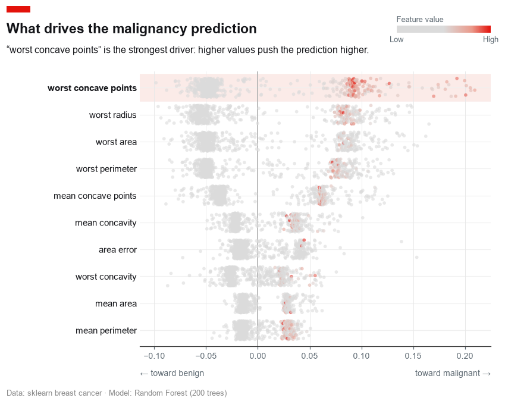
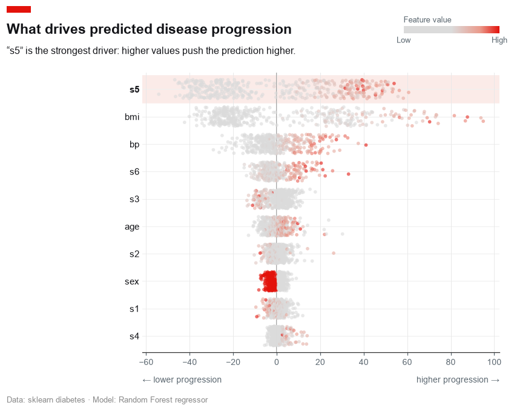
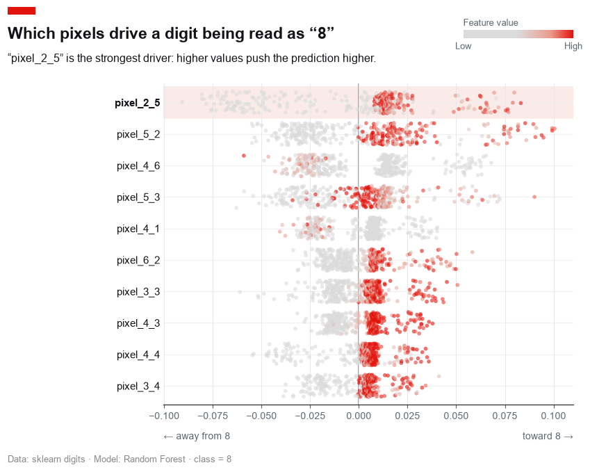
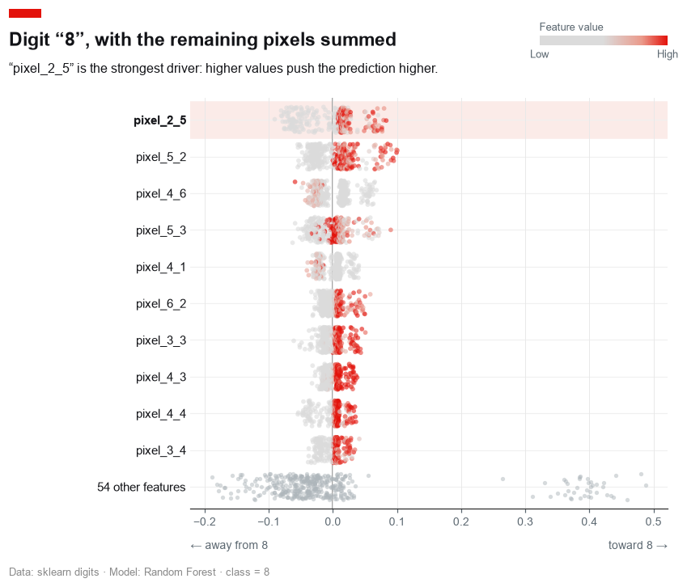
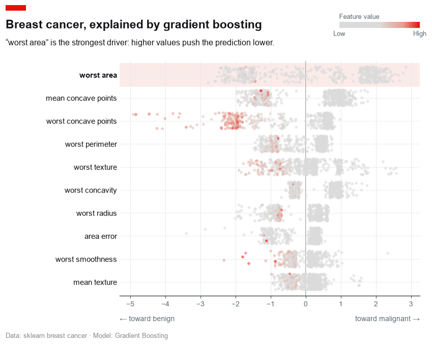
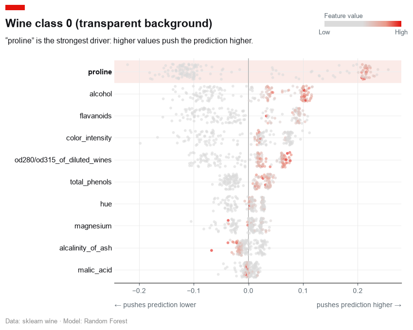

# Examples

Runnable examples for `shap-editorial`. Each trains a real model, computes real
SHAP values, and renders a chart into [`images/`](images/).

Examples are **namespaced by chart type** — scripts are prefixed with the chart
(`beeswarm_*.py`), and their outputs live under `images/<chart>/`. As new chart
types land (`waterfall`, `bar`), they follow the same convention
(`waterfall_quickstart.py` → `images/waterfall/`), so the folder stays tidy.

## Running

These need the optional `example` dependencies (shap + scikit-learn):

```bash
uv run --extra example python examples/beeswarm_quickstart.py
uv run --extra example python examples/beeswarm_gallery.py
```

On Python 3.13 (where the shap/numba wheels lag), use an isolated 3.12 env:

```bash
uv run --no-project --python 3.12 --with-editable . \
    --with shap --with scikit-learn --with matplotlib --with "numpy<2.1" \
    python examples/beeswarm_gallery.py
```

## Scripts

| Script | What it does | Output |
| ------ | ------------ | ------ |
| [`beeswarm_quickstart.py`](beeswarm_quickstart.py) | The canonical single example — a beeswarm of a `RandomForestClassifier` on the breast-cancer dataset. | [`images/beeswarm/hero.png`](images/beeswarm/hero.png) |
| [`beeswarm_gallery.py`](beeswarm_gallery.py) | Exercises the full range: binary, regression, multiclass, few vs many features, the opt-in aggregate row, and a transparent background. | [`images/beeswarm/`](images/beeswarm/) |

## Gallery — `beeswarm`

| | |
| :---: | :---: |
| **Binary classification**<br> | **Regression**<br> |
| **Multiclass, few features**<br> | **Multiclass, many features**<br> |
| **Aggregate "other" row**<br> | **Gradient boosting (binary)**<br> |
| **Transparent background**<br> | |
