# Examples

Runnable examples for `shap-editorial`. Each trains a real model, computes real
SHAP values, and renders a chart into [`images/`](images/).

Examples are **namespaced by chart type** — scripts are prefixed with the chart
(`beeswarm_*.py`, `waterfall_*.py`), and their outputs live under
`images/<chart>/`. Gallery file names are kept **parallel across chart types**
(`01_binary_classification`, `02_regression`, `03_multiclass_few_features`,
`04_multiclass_many_features`, `05_show_other`, `06_transparent`, …) so the same
case can be compared beeswarm-vs-waterfall at a glance.

## Running

These need the optional `example` dependencies (shap + scikit-learn):

```bash
uv run --extra example python examples/beeswarm_quickstart.py
uv run --extra example python examples/beeswarm_gallery.py
uv run --extra example python examples/waterfall_quickstart.py
uv run --extra example python examples/waterfall_gallery.py
```

On Python 3.13 (where the shap/numba wheels lag), use an isolated 3.12 env:

```bash
uv run --no-project --python 3.12 --with-editable . \
    --with shap --with scikit-learn --with matplotlib --with "numpy<2.1" \
    python examples/beeswarm_gallery.py
```

> **Saving:** the chart functions return `(fig, ax)`, so you can save in any
> matplotlib format — `fig.savefig("chart.png" | ".jpg" | ".svg" | ".pdf")`.
> Use SVG/PDF for crisp print output. For `transparent=True`, save to PNG/SVG/PDF
> (JPEG has no alpha channel and flattens the background).

## Scripts

| Script | What it does | Output |
| ------ | ------------ | ------ |
| [`beeswarm_quickstart.py`](beeswarm_quickstart.py) | The canonical single beeswarm — a `RandomForestClassifier` on the breast-cancer dataset. | [`images/beeswarm/hero.png`](images/beeswarm/hero.png) |
| [`beeswarm_gallery.py`](beeswarm_gallery.py) | Beeswarm across binary, regression, multiclass, few/many features, the aggregate row, transparent, and a second model. | [`images/beeswarm/`](images/beeswarm/) |
| [`waterfall_quickstart.py`](waterfall_quickstart.py) | The canonical single waterfall — one malignant case explained. | [`images/waterfall/hero.png`](images/waterfall/hero.png) |
| [`waterfall_gallery.py`](waterfall_gallery.py) | Waterfall across binary, regression, multiclass, few/many features, `show_other`, transparent, and a second model. | [`images/waterfall/`](images/waterfall/) |

## Gallery — `beeswarm`

| | |
| :---: | :---: |
| **Binary classification**<br>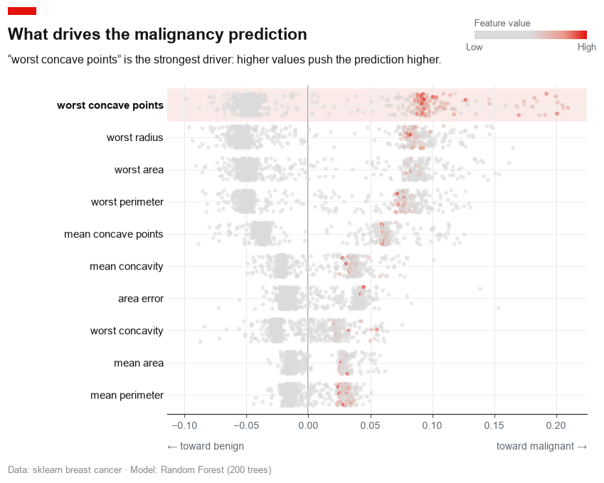 | **Regression**<br> |
| **Multiclass, few features**<br>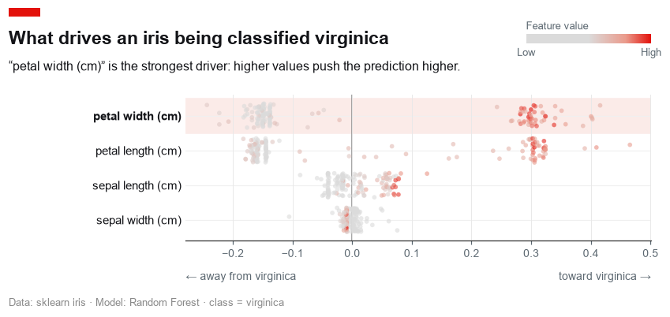 | **Multiclass, many features**<br>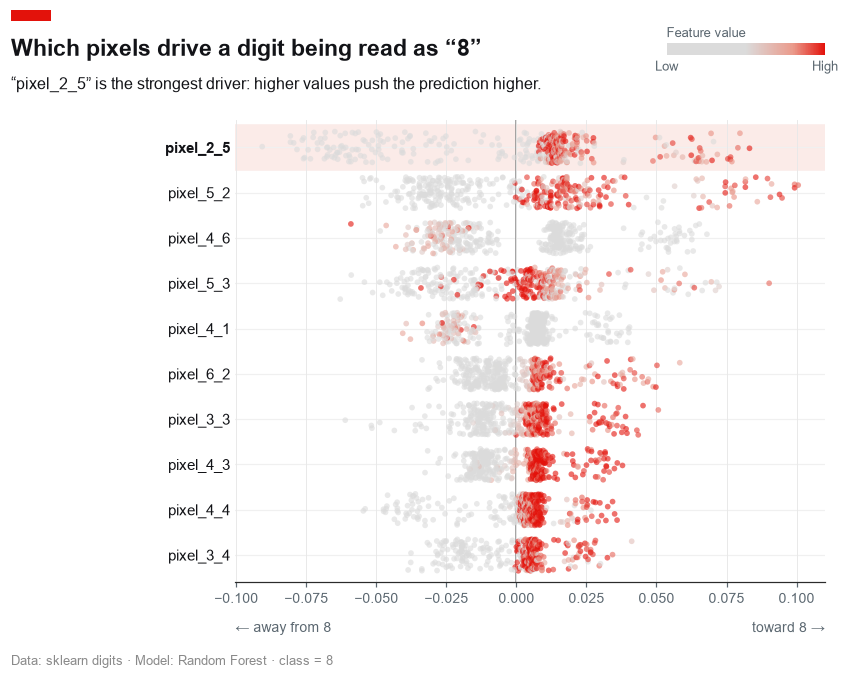 |
| **Aggregate "other" row (`show_other`)**<br>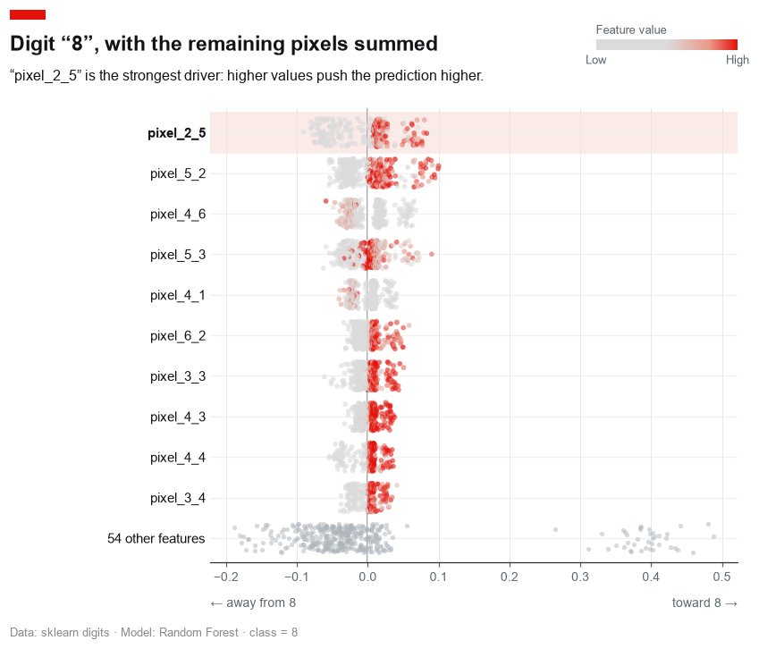 | **Transparent background**<br>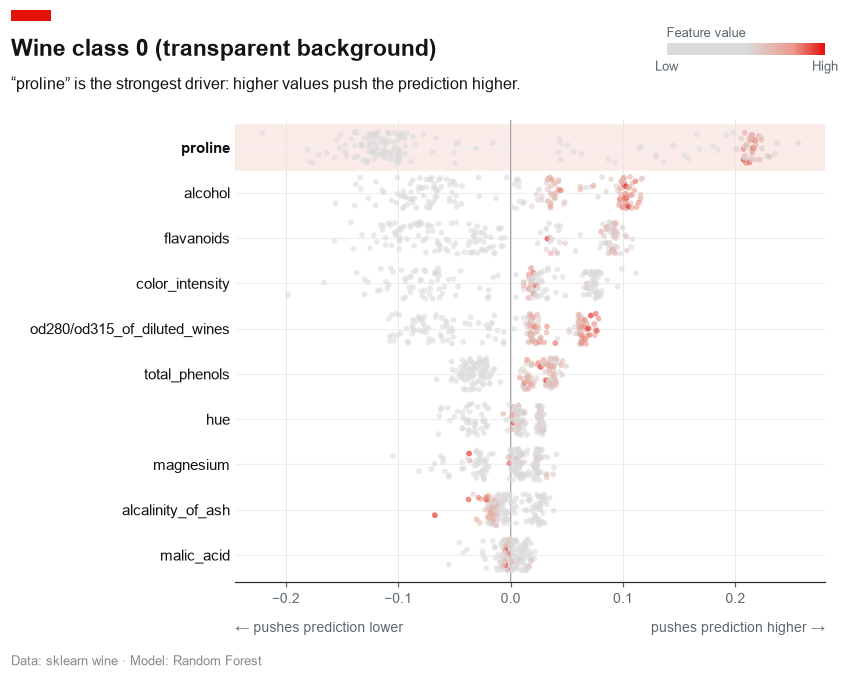 |
| **Gradient boosting (binary)**<br>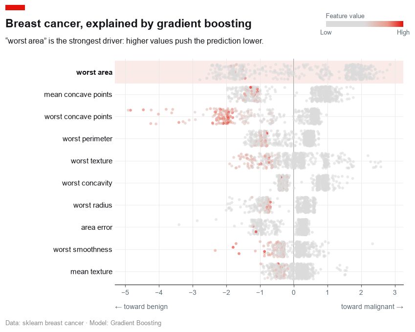 | |

## Gallery — `waterfall`

| | |
| :---: | :---: |
| **Binary classification**<br>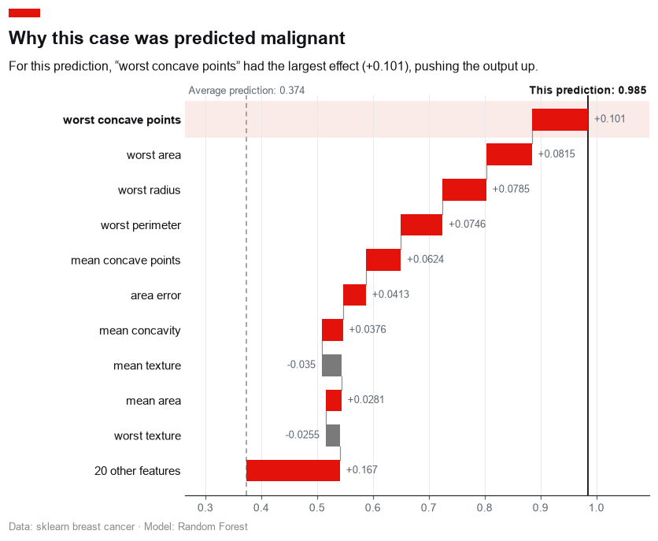 | **Regression**<br>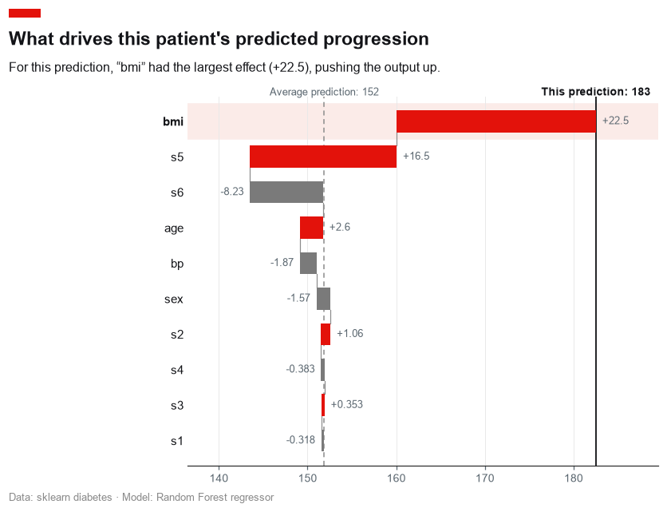 |
| **Multiclass, few features**<br>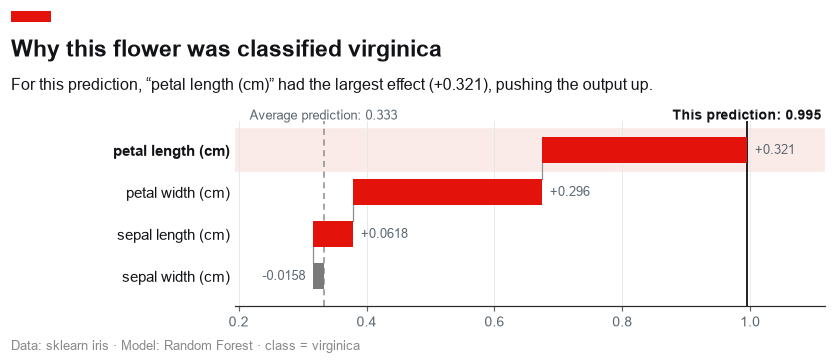 | **Multiclass, many features**<br>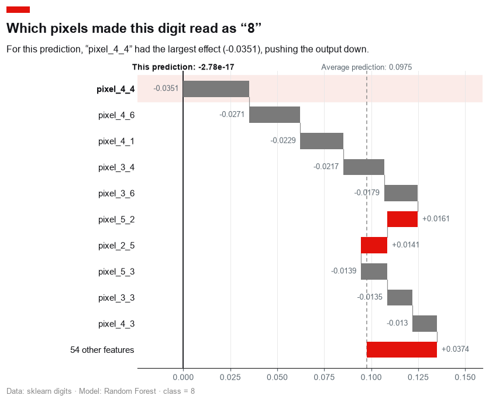 |
| **Top drivers only (`show_other=False`)**<br>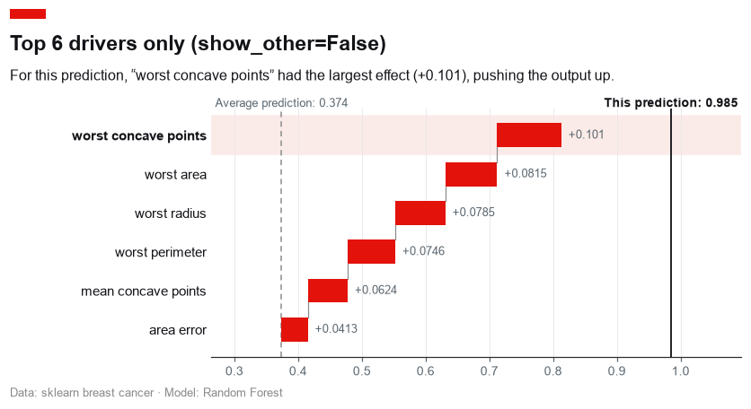 | **Transparent background**<br>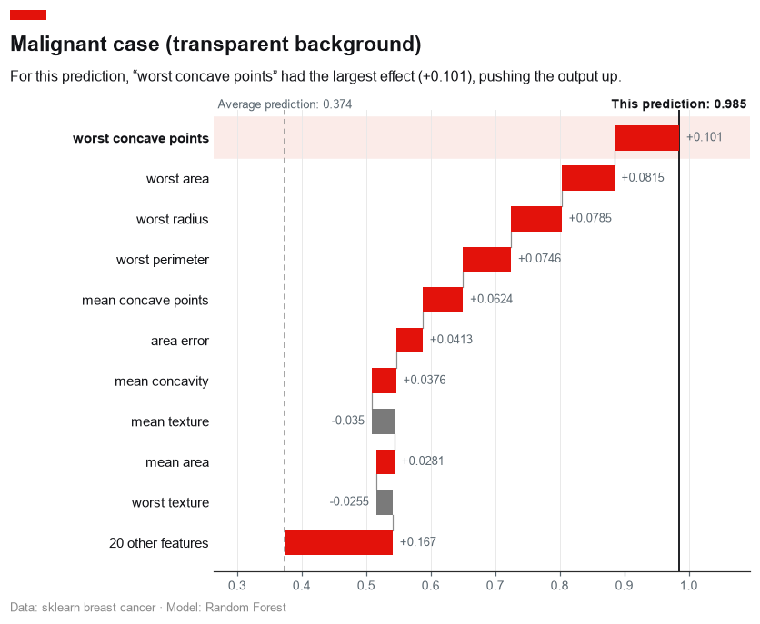 |
| **Gradient boosting (binary)**<br>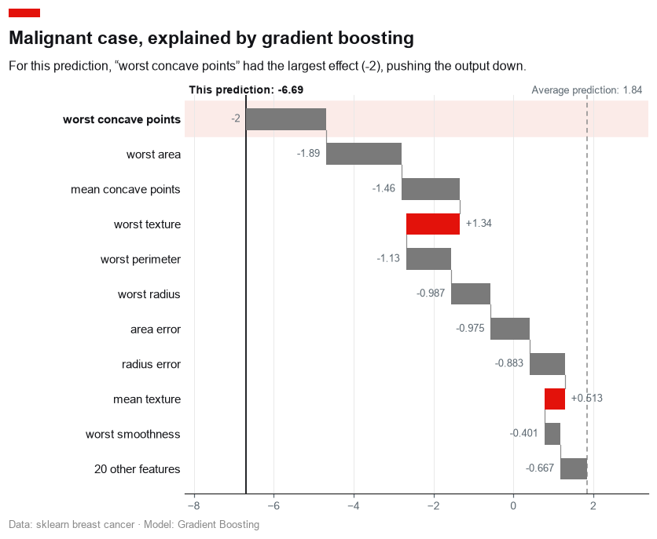 | |
